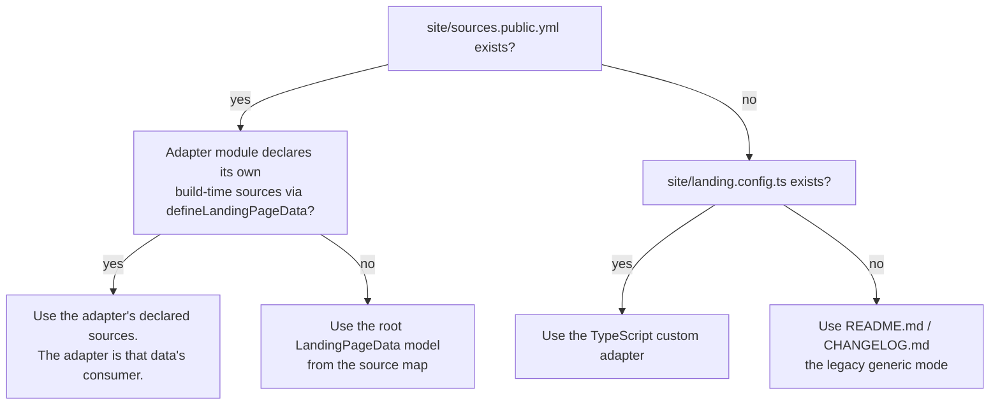

> Generated from `design/` by `/make-human-docs`. Do not edit by hand — edit the
> design docs and regenerate. `/reconcile` reports when this has gone stale.

# SubZeroDev.Platform.UI.LandingPage

A static landing-site builder you can drop into a repository without a
consumer-specific frontend project. It turns one of three kinds of input —
plain README/changelog files, a TypeScript custom adapter, or a versioned
JSON site model — into a static site, and ships the GitHub Actions plumbing to
deploy it.

This package does not supply product content, hosting policy, analytics, or
JSON-authoring tools, and it does not migrate an existing site for you. It
owns the build and the deploy mechanics; everything the site says is yours.

## Install and build

```powershell
npm install --save-dev subzerodev-platform-ui-landing-page@0.5.0
subzerodev-platform-ui-landing-page build
```

With no other configuration, the builder reads `README.md`, `CHANGELOG.md`, an
optional `site/README.md`, an optional `site/theme.css`, and an optional
`site/public/`, and writes `site/dist/` with a `/` route and a `/changelog/`
route.

During `0.x`, pin the exact package version and the exact commit SHA of any
GitHub Actions workflow you consume from this repository — there is no
semantic-versioning guarantee yet. A `1.0.0` release will start using major
versions for breaking CSS or DOM changes.

## Commands

- **`build`** resolves the site through the precedence below and writes it to
  `site/dist/` (or `--out-dir`).
- **`dev`** resolves the site through the same precedence, then serves it
  locally — see [Developing and looking at the built site](#developing-and-looking-at-the-built-site).
- **`preview`** builds, then serves the exact tree `build` just wrote.
- **`check`** runs the same build `build` does, so CI can confirm the site
  still builds.
- **`generate-changelog`** derives changelog entries from first-parent Git
  history — see [Deploying](#deploying).
- **`merge`** copies a built site into a documentation deployment tree
  without touching a protected path — see [Deploying](#deploying).

## Which input the build uses

A site can be described three ways, and the builder picks one per build. Each
level in the precedence exists because the one below it cannot express
something the level above can — a JSON source map can be swapped from a local
file to a published URL with no code change; a TypeScript adapter can compose
markup a plain JSON payload cannot; the README/changelog form needs neither.



Precedence is additive: a site holding both a source map and an adapter that
declares no sources of its own builds exactly what it built before the JSON
seam existed. A declared source that fails to load or validate ends the
build — the single opt-in recovery is `--fallback-source-id`, covered below.
A landing site quietly serving stale copy is worse than one that fails to
build, since nobody watches a static site the way they watch a running app.

## Legacy README/changelog mode

This is the default with no other files present. The builder renders
`README.md` and `CHANGELOG.md` as Markdown, sanitizing the output rather than
escaping it, because this Markdown exists to become markup. An optional
`site/README.md` supplies supplemental content, an optional `site/theme.css`
is loaded after the base stylesheet, and an optional `site/public/` is copied
into the output. The DOM and CSS surface this mode renders into is the
[generic contract](#generic-css-and-dom-contract) below.

## Custom TypeScript adapter

For an existing frontend site, export `defineLandingPage(...)` from
`site/landing.config.ts`:

```ts
export default defineLandingPage({
  routes: [
    {
      path: "/",
      entry: "src/main.ts",
      metadata: { title: "Home", description: "Home page" },
    },
  ],
});
```

Each route declares exactly one of `entry` or `body` — declaring both, or
neither, is an error.

- An **entry route** emits the toolkit shell (`<div id="root"></div>` plus a
  module script for that entry), same as before this package added the `body`
  form.
- A **body route** supplies the document body itself. That markup is emitted
  verbatim and no script is emitted, so the page loads nothing:

  ```ts
  export default defineLandingPage({
    routes: [
      {
        path: "/",
        body: "<main><h1>Composed at build time</h1></main>",
        stylesheet: "main { font: 1rem/1.5 system-ui; }",
        metadata: {
          title: "Home",
          description: "A page that loads no script.",
        },
      },
    ],
  });
  ```

  A body route may declare a `stylesheet`, emitted as the last element of the
  head inside a `<style>` element (CSS containing the string `</style` is
  rejected). Declaring `stylesheet` on an entry route is rejected outright
  rather than silently dropped — the same failure-over-silence rule that
  governs everything else in this package.

Every route path starts and ends with `/`, and each segment between matches
`[A-Za-z0-9._-]+` and is never `.` or `..` — so `/`, `/roadmap/` and
`/docs/v1.2/` are valid paths, while `/about`, `/../` and `/a//` are errors.
Two routes may not declare the same path. Both rules apply identically to a
`defineLandingPage` configuration and to a `LandingPageData` JSON model.

### Static head metadata

Every route requires `metadata.title` and `metadata.description`. A route can
also declare a canonical URL, a social image, Open Graph title / description /
type / URL / image / dimensions, an X/Twitter card and image, favicon or
Apple-touch-icon links, a theme colour, and route-specific `<noscript>` text.
The adapter emits only what a route actually declares — it invents no
defaults — and every value is HTML-escaped.

### Site-wide stylesheets

`styles` declares CSS files that belong to the whole site rather than to any
one route:

```ts
export default defineLandingPage({
  styles: ["site/base.css", "site/type.css"],
  routes: [
    {
      path: "/",
      entry: "src/main.ts",
      metadata: { title: "Home", description: "Home page" },
    },
  ],
});
```

Every custom-adapter document — entry and body routes alike — links each file
in declaration order, ahead of a body route's own `stylesheet`. So a route's
own CSS always overrides the site-wide rules, and never the reverse. No route
can opt out, and no route can add a site-wide link of its own. `styles` is
available on `LandingPageConfig` and on a JSON `AdapterLandingPageData` model
identically; it is not available on the generic shell, which already owns its
CSS through `site/theme.css`. A declared file that cannot be read ends the
build — an unstyled site that still builds and deploys is exactly the silent
failure this package avoids elsewhere. Declaring `styles: []`, or omitting it,
emits no link and no default.

### Consumer Vite plugins

A custom-adapter site may declare its own Vite plugins — a React site needs
`@vitejs/plugin-react` for Fast Refresh under `dev`, which the package cannot
supply on its own:

```ts
export default defineLandingPage({
  plugins: [react()],
  routes: [
    {
      path: "/",
      entry: "src/main.tsx",
      metadata: { title: "Home", description: "Home page" },
    },
  ],
});
```

`plugins` lives on `LandingPageConfig` only — a JSON `AdapterLandingPageData`
model cannot declare one, because a plugin is code and a fetched JSON document
must never name something the builder then executes; that asymmetry with
`styles` is deliberate. A site composed by `defineLandingPageData` returns a
`LandingPageConfig`, so it declares plugins the same way. One declared list
reaches both `build` and `dev`.

Declaring no plugins changes nothing: the emitted entry HTML, the `/`-relative
entry paths, `publicDir` staging and site-wide stylesheet links are exactly
what they were. Declaring one does — a plugin can rewrite emitted HTML and
asset URLs, so the static-head, route-path and output-layout guarantees above
hold only for a site that declares none; where one is declared, its output is
on the consumer, the same way a site-wide stylesheet's content is never
validated by this package, only its path and containment are.

Four things stay package-owned regardless of what a plugin declares, and each
refuses rather than silently narrowing:

- **Position.** The package's own plugin — the route middleware that answers
  every declared route — keeps its position ahead of Vite's built-in
  middleware; consumer plugins follow it, in declaration order.
- **The Vite config file.** `configFile: false` is unconditional, so a plugin
  cannot reintroduce a consumer-owned `vite.config.ts` — the duplication the
  adapter exists to remove.
- **`build.outDir`.** It stays exactly the directory the adapter was called
  with. A plugin that redirects it ends the build naming the directory it
  asked for, since the step that lifts generated entry documents into place
  trusts `outDir` unconditionally.
- **The dev server's filesystem sandbox.** `server.fs.allow` stays exactly the
  site root plus the resolved `allow` entries, and `server.fs.strict` stays
  on. A plugin that tries to widen either — by declaring it in a `config`
  hook, or by mutating the running server directly — ends the run naming what
  it tried to add, rather than taking effect.

## JSON-backed site data

> Requires `subzerodev-platform-ui-landing-page@0.4.1` and
> `subzerodev-data-json@0.2.0`. Use `0.4.1` rather than `0.4.0` — the earlier
> release reported only the first failing declared source, so fixing one
> input just revealed the next one instead of all of them at once.

When `site/sources.public.yml` exists, the builder reads a source through
[`subzerodev-data-json`](https://www.npmjs.com/package/subzerodev-data-json)
instead of the legacy files or the TypeScript adapter. `--source-map`
(default `site/sources.public.yml`) and `--source-id` (default
`landing-page`) select a different map or root source; an explicitly named
map that is missing is an error, but the default map being absent just falls
back to legacy resolution unchanged.

```yaml
# site/sources.public.yml
version: 1
sources:
  landing-page:
    at: build
    path: site/landing.json
    cache: manual
```

The selected root source must declare `at: build`. Because the builder never
branches on where a source lives, changing `path:` to `url:` for the same id
builds the identical site from a published artifact — a consumer can read a
bundled file locally and a published URL in CI by editing one line of the
source map, with no code change. Public source-map entries cannot declare
headers, and a source declared `at: runtime` is rejected for the root model.

Every model has `"version": 1` and exactly one `kind`: `"generic"` or
`"adapter"`. Unknown fields, unsupported versions, malformed metadata,
duplicate or invalid route paths, and declaring both or neither of
`entry`/`body` are all errors.

### A generic model

```json
{
  "version": 1,
  "kind": "generic",
  "home": {
    "markdown": "# Example site\n\nA static landing page loaded from JSON."
  },
  "supplemental": { "markdown": "## More detail\n\nThis content is optional." },
  "changelog": { "markdown": "# Changelog\n\n- First JSON-backed release" },
  "title": "Example site",
  "themeCss": ".szd-brand { color: rebeccapurple; }",
  "publicDir": "site/public"
}
```

`kind: "generic"` carries home Markdown, optional supplemental Markdown,
changelog Markdown, generic metadata and URLs, optional theme CSS, and an
optional public-directory path. Every Markdown value may carry a
repository-relative `assetBase` (default: the repository root) for resolving
local links and images from another directory. The Markdown is sanitized with
the same rules as the legacy README mode, so a compromised remote source can
change copy but cannot inject a script.

### An adapter model

```json
{
  "version": 1,
  "kind": "adapter",
  "publicDir": "site/public",
  "routes": [
    {
      "path": "/",
      "entry": "src/main.ts",
      "dataSourceIds": ["status"],
      "metadata": {
        "title": "Example status",
        "description": "An entry route with declared runtime data."
      }
    },
    {
      "path": "/legal/",
      "body": "<main><h1>Legal</h1><p>Static content.</p></main>",
      "stylesheet": "main { max-width: 60rem; margin: 2rem auto; }",
      "metadata": { "title": "Legal", "description": "A static body route." }
    }
  ]
}
```

`kind: "adapter"` carries `allow`, `publicDir`, `styles`, and the same
entry/body route declarations as the TypeScript adapter — `entry` paths are
relative to the directory holding `sources.public.yml`; `publicDir`, `allow`
and `styles` are relative to the repository root. Because a route's `body`
and `stylesheet` are emitted verbatim, a source you do not control can put
arbitrary markup on the page under this `kind` — prefer a local `path:` over
a remote `url:` for any adapter model you don't otherwise verify.

### Runtime data on an entry route

An entry route alone may declare `dataSourceIds`, naming public sources for
its own runtime use:

```yaml
sources:
  status:
    at: runtime
    url: https://status.example.com/data.json
    cache: manual
```

The builder emits exactly those declared sources — filtered from the public
map, escaped, and inert — as a `<script type="application/json"
id="szd-json-sources">` immediately before the route's module script. Every
`<` in the payload is escaped so it cannot terminate the script early. The
`szd-json-sources` id is part of the public DOM contract. The package
never constructs a browser loader itself; the entry module owns parsing the
element and building one, for example with `subzerodev-data-json`:

```ts
import { createJsonLoader, type SourceMap } from "subzerodev-data-json";

const element = document.querySelector<HTMLScriptElement>("#szd-json-sources");
// Absent on generic and body routes, and on an entry route that declared no
// dataSourceIds — check rather than letting JSON.parse("") throw.
if (!element?.textContent)
  throw new Error("No #szd-json-sources on this route.");
const sources = JSON.parse(element.textContent) as SourceMap;
const loader = createJsonLoader(sources, { fetch /* ... */ });
const status = await loader.loadById("status");
```

Generic and body routes never emit `#szd-json-sources` and make no runtime
data request — there is no script on those pages to read one.

This element is a property of built output, not source: the map it carries is
the prefetched one, whose build-time entries hold their resolved payload
rather than the path or URL the public map declared. `dev` therefore emits no
`#szd-json-sources` at all for an entry route, rather than one carrying a map
production never sends — an entry module that reads the element must already
tolerate its absence, the same tolerance a generic or body route requires.

### Falling back when a source fails

By default, a declared source that fails to load or validate ends the build
and the previous deployment stands. `--fallback-source-id` opts into
replacing a failed root model with another declared source, but only when the
root is the single source that failed — a failure elsewhere says nothing
about whether the root itself is trustworthy, so the build still ends:

```yaml
sources:
  landing-page:
    at: build
    url: https://the-running-dev.github.io/Data/landing/landing.json
    cache: manual
  landing-page-bundled:
    at: build
    path: site/landing.json
    cache: manual
```

```powershell
subzerodev-platform-ui-landing-page build --fallback-source-id landing-page-bundled
```

The fallback must be declared in the same map and must itself declare
`at: build`. The substitution is never silent — it is written to stderr,
naming the failed source, its reason, and the fallback used.

## Composing routes from build-time data

Where a site wants to compose its own markup from structured content instead
of serialising finished HTML into a JSON model, an adapter module can declare
the sources it needs and receive them validated and typed:

```ts
import {
  defineLandingPage,
  defineLandingPageData,
} from "subzerodev-platform-ui-landing-page";

type Content = { projects: Project[] };

export default defineLandingPageData<Content>(
  { projects: { id: "projects", validate: validateProjects } },
  ({ projects }) =>
    defineLandingPage({
      routes: [
        {
          path: "/",
          body: renderProjects(projects),
          metadata: { title: "Projects", description: "What exists so far." },
        },
      ],
    }),
);
```

`sources` carries one entry per key of your own `T`, each naming a source id
declared in the public source map and a `Validator` for that key's type.
Declaring no source, or an entry missing a string `id` or a `validate`
function, is an error. `config` receives the fully resolved `T` and returns a
`LandingPageConfig`; the package owns nothing about `T` or about `config` —
those are yours.

Every declared id must exist in the source map and declare `at: build`. Each
resolves through its own validator, and the validator is required rather than
optional: an unchecked cast would make `T` a claim this package cannot
support about JSON it never authored. Missing ids, non-build sources,
resolution failures and validator failures are all collected together, in
declaration order, each naming the adapter key and source id — so one
correction cycle can address every problem instead of one at a time. Any
failure ends the build before `config` runs.

When both a source map and an adapter module exist, an adapter that declares
sources through `defineLandingPageData` is selected over the root
`LandingPageData` model, because such an adapter is that data's consumer
rather than a competing description of the site. An adapter declaring no
sources is unaffected, and the root model is used — so adding this composition
style changes no existing build. `--fallback-source-id` does not apply here:
there is no root model to replace. An adapter declaring sources with no source
map present is an error.

## Developing and looking at the built site

`dev` serves the site locally. A custom-adapter site is served through Vite's
dev server, which transforms on request, so an edit to a component or an entry
module shows up without a restart. A generic site, and a custom-adapter site
composed by `defineLandingPageData`, instead build once at startup and serve
that output — re-resolving declared sources or re-rendering Markdown on every
request would refetch every source on every navigation, so an edit there needs
a restart. Declared site-wide `styles` are linked and served under `dev` the
same as in a build; `#szd-json-sources` is not, for the reason given
[above](#runtime-data-on-an-entry-route) — it is a property of the build the
dev server never runs.

`preview` builds, then serves the real built output — the same tree `build`
writes, with its generated route documents, fingerprinted asset names and
copied public files, rather than the dev server's approximation of them —
on `--out-dir` (default `site/dist/`) and `--port` (default `4173`). It reads
the same input flags `build` already reads, so `preview` and `build` given the
same flags describe the same site; `--adapter` and `--source-map`, which
select which mode a site is in, are the exception — mode is resolved once,
inside the `build` that `preview` runs, and never a second time. There is no
`--no-build` flag and no absent-`outDir` error: `preview` always shows the
current source rather than a build that may be stale by however long it has
been since the last one ran.

One static server implementation serves both `preview` and generic `dev`, so
the two cannot disagree about how a request resolves. A request path is
percent-decoded once and resolved against `outDir`; a path that is `/`, ends
in `/`, or names a directory resolves to that directory's `index.html`, so a
route path and the URL a reader types for it name the same document. A query
string or fragment never reaches the filesystem. A path resolving outside
`outDir` is never read — it is a 404, the same response given to a path naming
no file, and neither response carries filesystem detail. Every 200 carries a
`Content-Type` derived from the file's extension, which matters beyond
cosmetics: a built adapter route loads its bundle as a module script, and a
module served without a JavaScript media type does not execute.

## Generic CSS and DOM contract

The generic renderer (the legacy README/changelog mode and the `"generic"`
JSON `kind`) owns only selectors beginning `.szd-` and custom properties
beginning `--szd-`. Consumer CSS loads after the base stylesheet and may
target any of these:

```text
.szd-shell
  .szd-header
    .szd-brand
    .szd-nav
  .szd-main
    .szd-article
  .szd-footer
```

The document body has a `.szd-skip-link` before `.szd-shell`. Generic
Markdown renders into semantic `article`, headings, paragraphs, lists,
tables, code and links. The base custom properties are `--szd-bg`,
`--szd-surface`, `--szd-text`, `--szd-muted`, `--szd-accent`, `--szd-border`,
and `--szd-measure`.

## Deploying

The package ships a composite GitHub Action (`command: build`, `check`, or
`merge`) and a reusable `workflow_call` (`.github/workflows/deploy-pages.yml`
in this repository) that builds the site, optionally merges it with a
separately built documentation artifact, and deploys the result to GitHub
Pages. Deployment policy — permissions, triggers, concurrency, and
environments — is the calling repository's to set; this package only supplies
the build and merge steps.

`merge` combines the landing build with a documentation subtree:
`--landing-dist` names the built landing site, `--docs-output` (default
`artifacts/docs`) is the target tree, and `--protected-path` (default `docs`)
is the subtree that must not change. It refuses a landing build with no
`index.html`, a target with no protected subtree, and a landing build that
itself contains the protected path — but the guarantee it actually rests on is
the fingerprint: every file under the protected path is hashed with SHA-256
both before and after the copy, and any difference ends the command, rather
than trusting the landing build not to contain a colliding path. That
guarantee is detection, not rollback — a failure leaves a partially merged
tree behind.

### Deploying under a subpath

`--base-path` normalises to a leading and trailing `/` and defaults to `/`.
It prefixes the generic shell's own self-links and stylesheet hrefs, so a
site deployed under a project subpath still addresses its own documents. It
does not reach the custom-adapter forms, whose entry paths are already
`/`-relative to the site root Vite is given — it is a deployment concern, not
a content one, which is why it is a flag rather than a field on the JSON
model. It reaches both the legacy README/CHANGELOG generic form and a JSON
`kind: "generic"` model.

The composite action and the reusable `workflow_call` carry `base-path` too,
as a named input, alongside `docs-url` and `canonical-url` for the site's
documentation and canonical addresses. Each reaches the CLI only when the
caller sets it.

### Generating a changelog

`generate-changelog` derives entries from first-parent Git history, newest
first, inferring the repository from the `origin` remote unless
`--repository owner/name` is given. One entry is emitted per first-parent
commit; a subject ending in `(#<digits>)` becomes a pull-request link, and a
subject matching `update changelog` is dropped so the command's own commits
never accumulate in its own output. `--check` compares against the existing
file instead of writing, normalising CRLF first so the check passes on a
Windows checkout.

## Development

```powershell
npm install
npm run check
```
