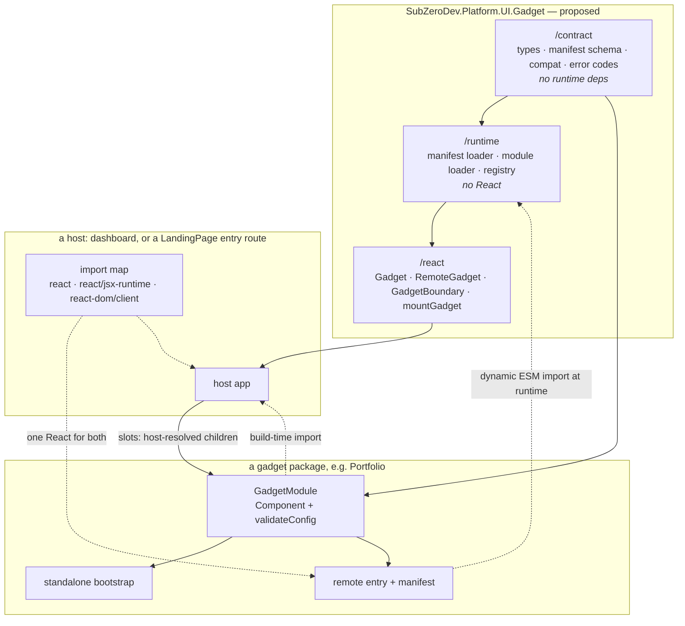

# Spike record — portable composable React gadgets

Issue: [#69](https://github.com/The-Running-Dev/SubZeroDev.Platform.UI.LandingPage/issues/69)
Date: 2026-08-20
Proof: [`spikes/composable-gadgets/`](composable-gadgets/) — 19 browser checks,
39 unit tests, 4 build-output assertions, all passing.

Observed facts are marked **Observed** and are taken from a named file at a
named SHA. Everything under _Selected architecture_ onward is inference and
recommendation, and is not a decision until signed off.

---

## 1. Observed repository facts

### `SubZeroDev.Platform.UI.LandingPage` @ `bb725b2`

- **The package has no React dependency, direct or peer.** `package.json`
  `dependencies` are unified/remark/rehype, `subzerodev-data-json`, `tsx` and
  `vite`. React exists nowhere in the tree. This matters more than anything
  else below: LandingPage is a Node build tool that bundles _someone else's_
  React, and every gadget question is therefore outside its current identity.
- **The npm surface is one export path**, `.` → `dist/index.js`
  ([`package.json`](../package.json)), exposing `defineLandingPage`,
  `defineLandingPageData`, `validateLandingPageData`, and their types
  ([`src/index.ts`](../src/index.ts)).
- **The CLI owns six commands** — `build`, `check`, `generate-changelog`,
  `merge`, `dev`, `preview` ([`src/cli.ts`](../src/cli.ts)).
- **An entry route is already a "mount a module into a container" boundary.**
  `html()` emits `<div id="root"></div>` plus a module script pointing at the
  route's `entry` ([`src/adapter.ts`](../src/adapter.ts)). Nothing about that
  shell is React-specific.
- **A build-time → runtime configuration channel already exists and is already
  inert by contract.** `#szd-json-sources` is emitted on an entry route that
  declared `dataSourceIds` (**C10**), and **C11** states the package emits
  runtime source declarations and never loads one — the consumer's entry owns
  parsing and loading ([`design/20-contract.md`](../design/20-contract.md)).
- **A route's `<head>` is closed.** `LandingPageMetadata` admits title,
  description, canonical, Open Graph, Twitter, icons, theme colour and
  `noScript`, and `html()` composes the head from exactly those
  ([`src/index.ts`](../src/index.ts),
  [`src/adapter.ts`](../src/adapter.ts)). There is no seam for arbitrary head
  content, and a `LandingPageBodyRoute` supplies a body, never a head.
- **The only existing escape hatch voids the guarantees.** **C23**: where a site
  declares Vite plugins, the static-head, route-path and output-layout
  guarantees no longer hold, and nothing detects it.

### `SubZeroDev.Platform.UI.Portfolio` @ `59e5abd`

- **The repository contains no code.** 35 tracked files: `design/`, `tools/`,
  the three agent-contract files. No `package.json`, no `src/`, no tests. The
  single commit is `chore: initialize agent kit`.
- **No GitHub repository of that name exists** under `The-Running-Dev`
  (`gh repo list`, 2026-08-20). There is an unrelated `The-Running-Dev/Portfolio`.
- **Its contract already specifies the build-time half of a gadget** — nine
  pure renderers, `*ViewModelV1` types, `validate*ViewModelV1`, an explicit CSS
  entrypoint whose DOM/class/token surface is semver-governed, and the rule that
  neither validation boundary may be replaced by a cast
  (`design/20-contract.md`). It specifies nothing about manifests, runtime
  loading, standalone bootstrap, or nesting.
- **Consequence for this spike:** Portfolio is not isolated enough to use as the
  proof gadget, because it does not exist as code. The issue anticipated this
  and authorised a trivial spike gadget.

### `SubZeroDev.GameEngine` @ `236f427` — the representative consumer

- `site/landing.config.ts` declares two entry routes (`/`, `/roadmap/`) and
  `allow: [".."]`; `site/src/` owns the React entirely.
- **The entry modules are unparameterised bootstraps.** `site/src/main.tsx` is
  `createRoot(document.getElementById("root")!).render(<StrictMode><App/></StrictMode>)`;
  `App.tsx` hard-codes its own routes and repository URL as module constants.
  There are no props, no services, no configuration seam, and no error boundary.
- **The containment boundary is a file path and nothing else.** LandingPage
  knows the string `src/main.tsx`. It knows nothing about what renders.
- `site/package.json` pins `subzerodev-platform-ui-landing-page` at `0.2.0`
  while the package is at `0.5.0`. Recorded as observed; not this spike's to fix.

### Answers to the two questions the issue asked to be answered explicitly

- **Does a generic gadget contract already exist accidentally inside
  LandingPage?** No. Two _fragments_ of one do: the entry-route shell is a
  container-plus-module mount point, and `#szd-json-sources` is a validated,
  inert configuration channel from build time to a browser entry. Neither
  carries identity, version, compatibility, lifecycle, services, slots, or
  failure semantics, and the consumer evidence above shows no consumer has
  grown them independently.
- **Does runtime composition justify its complexity?** Yes, but narrowly, and
  the cost is smaller than expected: the runtime half of the proof is ~150
  lines of loader plus a 44-line generated import-map shim, and it bought a
  gadget that mounts without rebuilding the host. What did _not_ justify itself
  is anything beyond a manifest and a dynamic `import()` — see §3.

---

## 2. Refined requirements

Derived from the issue, narrowed to what the proof could actually settle.

| #   | Requirement                                                                         | Settled by                    |
| --- | ----------------------------------------------------------------------------------- | ----------------------------- |
| R1  | One implementation of the UI serves all four roles                                  | §4, §6 — one `GadgetModule`   |
| R2  | Startup configuration, host services, slots, theme and internal state stay distinct | `GadgetProps`                 |
| R3  | A host may refuse an incompatible gadget before executing any of its code           | proven: import never called   |
| R4  | Configuration crossing the runtime boundary is validated, never cast                | `validateConfig` per gadget   |
| R5  | Every failure mode resolves to a value, not a thrown host crash                     | 4 contained failures          |
| R6  | Runtime loading yields exactly one React                                            | proven by identity _and_ size |
| R7  | Nesting must not create circular package dependencies                               | host-resolved named slots     |
| R8  | CSS isolation is measurable in both directions                                      | measured; result in §6        |
| R9  | Unmount is clean and remount is possible                                            | proven, with one caveat       |
| R10 | LandingPage keeps every existing behaviour                                          | `npm run check` green         |

Explicitly **not** required, and not built: a universal event bus, a service
locator, SSR, authentication, marketplace discovery, framework independence.

---

## 3. Evaluated options

Assessed against the issue's criteria. "Proof" marks the option the spike
actually implemented; the rest were assessed on the evidence above and on the
shape of the code they would have required.

| Option                         | React singleton                                                               | Runtime discovery                       | Type safety                                          | CSS isolation     | Nesting                       | Cross-origin / CSP                                       | Complexity                                                   |
| ------------------------------ | ----------------------------------------------------------------------------- | --------------------------------------- | ---------------------------------------------------- | ----------------- | ----------------------------- | -------------------------------------------------------- | ------------------------------------------------------------ |
| **Native ESM + import map** ✅ | Solved by the map; provable by identity                                       | Manifest + `import()`                   | Full at build, validated at runtime                  | Host's choice     | Natural (slots)               | Needs `script-src` for the remote and for the inline map | ~150 lines + a generated shim                                |
| Native ESM, no import map      | Needs a factory-injected `React`, and `react/jsx-runtime` drags React back in | same                                    | same                                                 | same              | same                          | no inline map needed                                     | Lower infra, but taxes every gadget author                   |
| Module Federation              | Solved by the runtime's negotiation                                           | Remote entry, not a manifest            | Requires generated remote types                      | Host's choice     | Natural                       | Same, plus a bundler runtime on every page               | A bundler plugin on host and every gadget                    |
| Web Component wrapper          | Not solved — the custom element still has to get React from somewhere         | Registry is global and single-namespace | Attributes are strings; props need an imperative API | Shadow by default | Slots exist but are DOM-level | Same                                                     | Adds a second lifecycle per gadget                           |
| iframe                         | Trivially solved — a second React by design                                   | URL                                     | Postmessage schemas only                             | Total             | Only via nested frames        | Simplest CSP story                                       | Layout, focus, a11y and sizing all become the host's problem |
| Build-time only                | Trivially solved                                                              | None                                    | Best                                                 | Host's choice     | Natural                       | None                                                     | Lowest — and fails the stated goal                           |

**Chosen: native ESM + import maps.** It is the only option that leaves the
gadget a plain React component in all four roles. Module Federation buys
host/remote negotiation this system does not need — there is one shared
dependency and the host controls the deployment. Web Components add a second
lifecycle to every gadget and do not solve the dependency question they are
usually reached for. iframes are the right answer for untrusted third-party
gadgets and the wrong one here, where every gadget is first-party and has to
share layout with the host. Build-time only is the honest fallback if the
runtime story is ever abandoned; the proof shows it does not need to be.

**Factory injection** (`export default (deps) => GadgetModule`) deserves the
runner-up note: it removes the import map entirely, at the cost of taxing every
gadget's authoring and of `react/jsx-runtime`, which is not stateless enough to
duplicate safely — it reaches React's internals, so duplicating it duplicates
React. Rejected for that reason, not for elegance.

---

## 4. Proof structure

```
spikes/composable-gadgets/
  src/contract/      types, manifest schema, compatibility, error codes — no runtime deps
  src/runtime/       manifest loader, module loader, registry, style attachment — no React
  src/react/         Gadget, RemoteGadget, GadgetBoundary, mountGadget
  src/gadgets/counter/  the proof gadget: component, config validator, CSS, remote entry
  src/gadgets/panel/    a gadget that is also a host surface (the nesting case)
  src/host/          dashboard page, standalone page, in-browser assertions
  src/shared/        generated shims the import map resolves to
  scripts/           shim generation, build-output assertions
```

Three builds, deliberately separate because their externals differ:

| Build    | Output               | React         |
| -------- | -------------------- | ------------- |
| `host`   | two HTML pages       | external      |
| `shared` | `/shared/*.js`       | bundled, once |
| `remote` | `/gadgets/counter/*` | external      |

The `shared` build is one Rollup build on purpose: three separate builds would
each bundle their own React, and the singleton claim would read as true while
being false.

---

## 5. Commands used

```bash
# repository reality
git log -5 --oneline; rg --files
gh issue view 69; gh repo list The-Running-Dev --limit 100

# the proof
cd spikes/composable-gadgets
npm install
npm run verify            # typecheck + 39 tests + 3 builds + 4 bundle assertions
npm run preview           # http://localhost:4319

# LandingPage's own gates, unchanged
npm run check             # from the repository root
```

---

## 6. Evidence and test results

### Browser — 19/19, `http://localhost:4319/`, Chromium

Run on load against the real DOM; `window.__SPIKE_RESULTS__` holds the
machine-readable form.

| Claim                                        | Evidence                                                                                                       |
| -------------------------------------------- | -------------------------------------------------------------------------------------------------------------- |
| Build-time composition                       | Two instances render from a normal `import`                                                                    |
| Two configured instances                     | Start values `0` / `100`; two clicks on the first give `2` / `100`                                             |
| Runtime discovery and loading                | Manifest fetched, validated, entry imported, gadget mounted                                                    |
| Nested composition                           | `.szd-gadget-panel .szd-gadget-counter` — the container gadget imports no gadget                               |
| **Single React instance**                    | `Object.is(remoteModule.runtimeReact, hostReact) === true`                                                     |
| Two themes on one page                       | `rgb(247, 230, 216)` vs `rgb(216, 236, 247)` from one stylesheet                                               |
| Manifest styles reach an isolated root       | The shadow-root instance is styled although no document `<link>` can reach it                                  |
| **Host CSS reaches into a light-DOM gadget** | A host `button { letter-spacing: 4px }` produced `4px` **inside** the gadget                                   |
| Shadow DOM blocks it                         | The same rule produced `normal` inside the shadow root                                                         |
| Gadget CSS does not leak outward             | The host's own button keeps its user-agent border, not the gadget accent                                       |
| Four contained failures                      | `contract-incompatible`, `entry-unreachable`, `config-invalid`, `render-failed` — each a fallback, host intact |
| Clean unmount                                | Effect cleanup ran; no gadget DOM left                                                                         |
| Remount                                      | Same module from the registry cache, state back at the configured start                                        |

### Build output — 4/4, `scripts/verify-bundles.mjs`

- The remote imports `react` and `react/jsx-runtime` as bare specifiers.
- The remote contains no React internals (`react.transitional.element`,
  `react.forward_ref` both absent) in **2 096 bytes**.
- `/shared/react.js` and `/shared/react-dom-client.js` import the _same_
  emitted chunk.

The size check earns its place: it is the assertion that fails loudly if a
future change drops the `external` list, which is the exact way a second React
gets shipped without any symptom at render time.

### Unit — 39/39, vitest + jsdom

Manifest validation has a positive case and eight negative ones; config
validation a positive and six negative. The load path proves **compatibility is
checked before the import happens** — `importModule` is asserted _not_ called
for an incompatible manifest. The registry proves one load serves many
instances, and that a _failed_ discovery is not memoised, so it stays
retryable.

### LandingPage's own gates

`npm run check` passes on this branch: prettier, eslint, `tsc --noEmit`, `tsc`
build, **112 vitest tests**, `npm pack --dry-run`.

**One pre-existing flake was found and confirmed, not introduced.**
`test/json-source.test.ts` intermittently fails with
`ENOTEMPTY: directory not empty, rmdir '…/site/.vite'` — Vite writes its cache
directory asynchronously after the dev server closes, and the test's teardown
races it. It only appears under the full parallel suite, never when the file is
run alone. **Reproduced on `main` at `bb725b2`**: two failures in one
`npx vitest run`, clean on the next. Recorded rather than fixed — it is a
defect in an existing test and belongs in its own bug issue, not in a spike.

### Two findings that contradict the comfortable answer

1. **Naming conventions do not isolate CSS.** Prefixes and `@layer` stop a
   gadget leaking _outward_, and stop nothing coming _inward_. A host rule as
   ordinary as `button { … }` reached inside the gadget and changed it. This is
   measured, not argued.
2. **A "clean" unmount leaves the injected stylesheet behind.** Deliberate — it
   is what makes remount cheap — but there is no reference counting, so a host
   that mounts and unmounts many different gadgets accumulates `<link>`
   elements without bound.

---

## 7. Selected architecture



The five decisions the diagram encodes:

1. **The boundary is a React component descriptor, not an imperative API.**
   `mountGadget` exists, is provided _once_ by `/react`, and is derived from the
   component. The proof settles this rather than asserting it: making isolation
   a host parameter — the same gadget into the light DOM or into a shadow root,
   with no gadget-side change — is only possible because the host owns the root.
   An imperative-first contract puts `attachShadow` inside every gadget.
2. **One React, by deployment.** The host declares an import map; every bundle
   marks React external. This is checkable at build time and provable at
   runtime, and both checks are in the proof.
3. **Configuration is validated at the boundary it crosses.** The gadget owns
   `validateConfig` because the gadget is the only thing that knows what its
   configuration means. `GadgetProps` keeps configuration, services, slots,
   theme and internal state apart — the separation is the contract's main
   content.
4. **Nesting is host-resolved slots.** `PanelGadget` renders `slots.body` and
   imports no gadget. A container therefore cannot depend on what it contains,
   which is what makes circular package dependencies structurally impossible
   rather than merely discouraged.
5. **Isolation is a host decision with a stated default.** Default: prefixed
   classes in a cascade layer, which is cheap and leaks inward. Opt-in:
   `isolation: "shadow"`, which does not. The gadget is identical either way.

Failures resolve to values: six codes (`manifest-invalid`,
`contract-incompatible`, `entry-unreachable`, `entry-malformed`,
`config-invalid`, `render-failed`), each surfaced on the fallback element as
`data-gadget-error`, so a host can style, log or route them without parsing a
message.

---

## 8. Rejected alternatives

| Rejected                                          | Why                                                                                                                     |
| ------------------------------------------------- | ----------------------------------------------------------------------------------------------------------------------- |
| Module Federation                                 | Buys host/remote negotiation for a system with one shared dependency and one deployment owner                           |
| Web Component as the runtime boundary             | A second lifecycle per gadget, string-typed attributes, and it does not answer the React-singleton question at all      |
| iframe isolation                                  | Correct for untrusted third-party gadgets; here it makes layout, focus and accessibility the host's problem for nothing |
| Build-time only                                   | Fails the stated goal. Kept named as the fallback if the runtime half is ever abandoned                                 |
| Factory injection instead of an import map        | Taxes every gadget's authoring, and `react/jsx-runtime` reaches React's internals, so it cannot be duplicated safely    |
| An imperative `mount`/`unmount` as _the_ contract | Would have moved the isolation choice, error boundary and root ownership into every gadget                              |
| Shadow DOM as the default                         | Untested costs around portals, overlays, focus and tooling; made opt-in until those are measured                        |
| Gadget-declared CSS isolation                     | Isolation is a property of where a gadget is mounted, which the gadget does not know                                    |
| A shared event bus                                | Explicit non-goal; `services.emit` is one optional callback whose absence has a defined meaning                         |
| Putting the config schema in the JSON site model  | Mirrors **C24**'s reasoning: a fetched document must not name something the host then executes                          |

---

## 9. Proposed public contract

The full text is [`spikes/composable-gadgets/src/contract/index.ts`](composable-gadgets/src/contract/index.ts)
(219 lines, no runtime dependency beyond React's _types_). Its shape:

```ts
export const GADGET_CONTRACT_VERSION = 1;

export type GadgetProps<TConfig> = {
  config: TConfig;                                  // immutable, validated once
  services?: GadgetHostServices;                    // host capabilities, all optional
  slots?: Readonly<Record<string, ReactNode>>;      // host-resolved children
  theme?: string;                                   // flavour only, never behaviour
};

export type GadgetModule<TConfig = unknown> = {
  id: string;
  version: string;
  contractVersion: number;
  displayName: string;
  Component: ComponentType<GadgetProps<TConfig>>;
  validateConfig: (raw: unknown) => TConfig;        // throws, never casts
  runtimeReact: unknown;                            // diagnostic; see §11
};

export type GadgetHostServices = {
  navigate?: (target: string) => void;
  emit?: (event: GadgetEvent) => void;
  log?: GadgetLogger;
  resolveAsset?: (path: string) => string;
};

export type GadgetManifest = {
  schemaVersion: 1;
  id: string; version: string; displayName: string;
  entry: string; styles?: readonly string[];
  contractVersion: number; capabilities?: readonly string[];
};

validateGadgetManifest(raw: unknown): GadgetManifest
assertCompatible(manifest, hostContractVersion?): void
assertGadgetModule(value, manifest): asserts value is GadgetModule
class GadgetError extends Error { code: GadgetErrorCode; gadgetId?: string }
```

Two properties worth stating because the declarations cannot:

- **Every optional service has a defined meaning when absent.** `navigate`
  absent means the gadget renders a plain link and lets the document navigate;
  `emit` absent means events are dropped and a gadget may not depend on
  delivery; `log` absent means silence. Without this a gadget becomes coupled to
  hosts that happen to supply everything.
- **`source` on an event is stamped by the host layer, not by the gadget.** The
  proof asserts this: a gadget cannot attribute its events to another gadget.

---

## 10. Package-boundary recommendation

**The evidence does not support the issue's stated bar, and supports the
package anyway — for a different reason.** The issue said a generic contract
package is justified only if two independently useful UI modules need it. Only
one candidate module exists (Portfolio, and it is design-only). But the spike
surfaced an asymmetry the bar does not account for:

- The **gadget half** (component, validator, manifest, standalone bootstrap)
  can live inside a product package such as Portfolio.
- The **host half** (loader, registry, boundary, `RemoteGadget`, `mountGadget`
  — ~350 lines) cannot. It belongs to whoever _hosts_ gadgets, which is not
  Portfolio, and both halves must share the same contract types.

So the boundary is forced by the host, not by a second gadget.

**Recommended: one small package, three export paths.**

```
SubZeroDev.Platform.UI.Gadget
  /contract   types, manifest schema, compatibility, errors   — no runtime deps
  /runtime    manifest loader, module loader, registry        — no React
  /react      Gadget, RemoteGadget, GadgetBoundary, mountGadget
```

Only the subset the proof exercised. Not `composition slots` as a separate
concern — slots turned out to be a prop, not a mechanism.

**The alternative, if the issue's bar is to be held to:** defer the package
entirely; Portfolio ships the gadget shape behind a subpath export, and the
first host application vendors the host half. Cost: the contract's identity
lives inside a product package, and the second host duplicates ~350 lines
before anyone notices. Reversal is cheap in both directions — the code is pure
types plus stateless functions — so this is a judgement about which cost is
more visible, not about which is permanent.

**This is the one genuine fork in the record and it needs a decision.**

### Relationship to LandingPage

LandingPage should **not** become the mandatory runtime host, and should not
gain React. Three things it can do without changing what it is:

1. **Build a standalone gadget site today, unchanged.** An entry route pointing
   at a gadget's standalone bootstrap is exactly the shell the proof used. This
   needs no contract change.
2. **Carry a manifest and a gadget bundle into a deployment.** `publicDir` and
   `merge` already do this; a manifest is a static JSON file.
3. **Deliver immutable startup configuration.** `#szd-json-sources` (**C10**,
   **C11**) is already a validated, inert build-time → runtime channel that the
   package emits and never loads. That is precisely the shape a gadget's
   `config` wants, and the inertness is precisely the property that makes it
   safe.

**One concrete gap.** A LandingPage-built document cannot declare an import map:
the head is composed from `LandingPageMetadata` and admits no arbitrary content,
and `LandingPageBodyRoute` supplies a body rather than a head. The only route
available today is a consumer Vite plugin — which **C23** says voids the
static-head, route-path and output-layout guarantees, undetectably. So a
LandingPage-built page can host a _build-time_ gadget now, and cannot host a
_runtime-loaded_ one without either a contract amendment or giving up C23's
guarantees. That amendment is `/contract`'s work and is named as a next step
rather than proposed here.

---

## 11. Risks

| Risk                                                                                                                         | Status                                     |
| ---------------------------------------------------------------------------------------------------------------------------- | ------------------------------------------ |
| **CSP**: an inline `<script type="importmap">` needs a nonce or hash, and the remote origin needs `script-src`               | Not exercised — the proof runs with no CSP |
| **Cross-origin**: the proof is same-origin; the manifest fetch and the ESM import both need CORS                             | Not exercised                              |
| **Cache invalidation**: the manifest is the indirection, but a manifest cached longer than its bundle is the classic failure | Not exercised — no cache headers set       |
| **Inbound CSS**: prefixes and layers do not stop host cascade — measured, and true                                           | Known; shadow mount is the mitigation      |
| **Shadow DOM costs**: portals, overlays, focus, `:focus-visible`, and axe/testing-library behaviour                          | Unmeasured — the reason it is opt-in       |
| **Stylesheet residue**: unmount leaves the injected `<link>`; no reference counting                                          | Deliberate, unbounded                      |
| **`runtimeReact` is a contract member that exists only to be inspected**                                                     | A smell; see §12                           |
| **Concurrent React across the boundary**: Suspense, transitions, context are untested through a remote                       | Unmeasured                                 |
| **Two versions of one gadget on a page**: the registry keys by manifest URL, so it should work                               | Untested                                   |
| **SSR**: the gadget is client-only                                                                                           | Non-goal, per the issue                    |
| **LandingPage's import-map gap**                                                                                             | Real, named in §10                         |

---

## 12. Unresolved questions

1. **Is `runtimeReact` contract or diagnostic?** It earned its place — it is how
   the singleton claim is _proved_ rather than assumed — but a public field that
   exists to be introspected is a smell. Alternative: a separate
   `/contract/diagnostics` export that a host may check in development only.
2. **What is the compatibility rule beyond exact-major?** `assertCompatible` is
   exact equality today because there is one version. The first bump has to
   decide whether a host implementing 2 accepts a gadget declaring 1.
3. **Who owns the import map?** The host page does today. If LandingPage ever
   emits one, its content becomes part of LandingPage's public surface, which
   is a much larger commitment than a head seam.
4. **Does `capabilities` do anything?** The manifest carries it and nothing
   reads it. Either it gates behaviour or it should be removed before it becomes
   decoration that has to be kept semver-stable.
5. **Where do a gadget's own assets live?** `resolveAsset` is declared and
   unexercised. A runtime-loaded gadget's base URL is its entry's, not the
   host's, and nothing in the proof depends on that yet.
6. **The issue's package bar versus the host-half asymmetry** — §10.

---

## 13. Proposed next slices

Narrow, independently testable, in dependency order. None of these is
authorised by issue #69; they are the sequence a decision on §10 would start.

| Slice | Work                                                                                                             | Independently testable by                             |
| ----- | ---------------------------------------------------------------------------------------------------------------- | ----------------------------------------------------- |
| G1    | Contract module: types, manifest schema, `assertCompatible`, `assertGadgetModule`, error codes. No React runtime | Positive + negative validators, per this repo's rule  |
| G2    | Host React layer: `Gadget`, `GadgetBoundary`, the config-validation seam, failure codes as data attributes       | jsdom: sibling survives every failure class           |
| G3    | Runtime layer: manifest loader, module loader, registry, injected IO, non-memoised failures                      | Injected IO; assert no import on incompatible         |
| G4    | Shared-dependency policy: import-map generation and a build assertion that a remote bundles no React             | The bundle assertions in `scripts/verify-bundles.mjs` |
| G5    | Imperative `mountGadget` and host-chosen isolation, with the inbound-cascade measurement as a real test          | Browser test measuring computed style both ways       |
| G6    | Portfolio ships one real gadget through all four modes                                                           | The four modes, per §6                                |
| G7    | **`/contract`, not a slice** — a LandingPage seam for a document-head import map on an adapter entry route       | Contract amendment first; C23 is the thing at stake   |

---

## 14. What this spike did not do

Per the issue's authority block: nothing was published, deployed, or released.
No package was created. `design/` was not edited — this record is the artifact,
and every contract question it raises is named as `/contract`'s work rather
than answered here. LandingPage's behaviour is unchanged; the only edits
outside `spikes/` are three ignore entries (eslint, vitest, prettier) that keep
the repository's own gates from running against an isolated workspace with its
own toolchain.
